<!-- ===================== -->
<!--  GITHUB PROFILE README -->
<!-- ===================== -->

---

## Live Portfolio Website

Status: **In progress** · Preview: **https://alexou.ca/**

---

## About Me

Hi, I'm **Zi Feng (Alex) Ou** — a Computer Science student at **Wilfrid Laurier University** (Waterloo Campus) with strong interests in **backend systems, data engineering, and applied AI/ML**.

I enjoy building **end-to-end solutions** — from system design and REST APIs to data pipelines and intelligent features — with a focus on **reliability, scalability, and real-world impact**.

- 🎓 BSc Computer Science, Fall 2022 – Present
- 💼 IoT Software Developer Intern @ Guangzhou Mingliang Energy Saving Technology (Summer 2024)
- 🏫 Member of **Laurier Computing Society** (Fall 2024 – Present)
- 🌐 Portfolio: [alexou.ca](https://alexou.ca/) · LinkedIn: [in/alexou](https://linkedin.com/in/alexou) · GitHub: [github.com/alexou8](https://github.com/alexou8)

---

## Technical Skills

### Programming Languages

### Frameworks & Libraries

### Databases & Data

### Systems & Tools

### Development Areas

---

## Additional Information

### Languages

### Interests
- PC Building · Keyboard Enthusiast · Golf · Tennis · Badminton · Pickleball · Cooking · Travelling

---

⭐ Feel free to check out my pinned projects below — always open to collaboration and learning!
