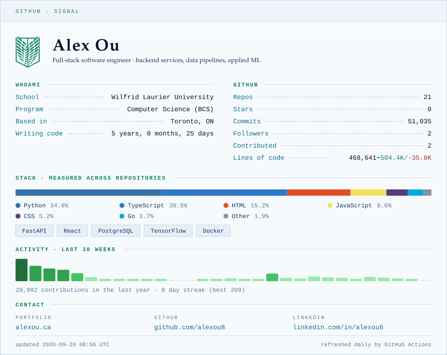

  <picture>
    <source media="(prefers-color-scheme: dark)" srcset="./dark_mode.svg">
    <source media="(prefers-color-scheme: light)" srcset="./light_mode.svg">
    
  </picture>

   

  <!-- The card above is an image, so the addresses on it are not clickable.
       These are. -->
  <a href="https://alexou.ca"><b>Portfolio</b></a>
  &nbsp;·&nbsp;
  <a href="https://github.com/alexou8?tab=repositories"><b>Projects</b></a>
  &nbsp;·&nbsp;
  <a href="https://linkedin.com/in/alexou8"><b>LinkedIn</b></a>

